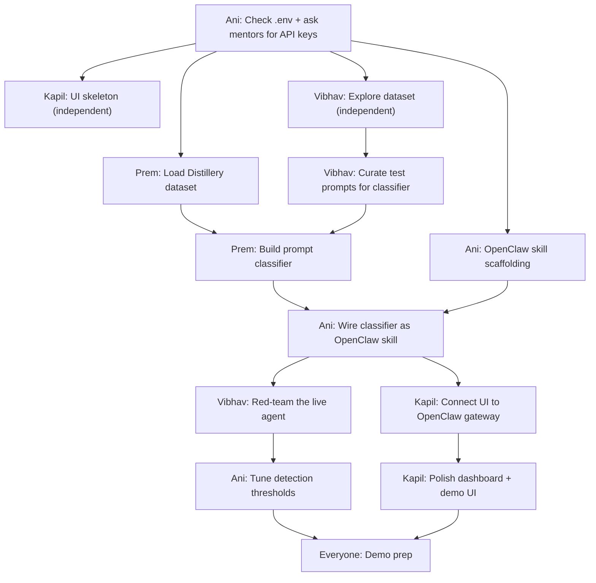

# ShieldClaw — Hackathon Plan (Due: 4pm today)

## Context

Team of 4 (Ani, Kapil, Prem, Vibhav) at the Personalized Agents Hackathon hosted by Lightning AI + Validia at Newlab Brooklyn. Goal: build a personalized autonomous agent using OpenClaw on Lightning AI that integrates Validia's security tools. Judged on capability AND resilience ("hardest to break" wins).

## What We Have Access To

| Resource | Status | Notes |

|----------|--------|-------|

| Lightning AI Studio | **LIVE** | OpenClaw template running, `.env` + `.openclaw/` already configured |

| $50 Lightning AI credits | **x4 = $200 total** | Per team member |

| Validia Distillery repo | **Cloned** | 54K synthetic attack prompts dataset, needs OpenAI API key to generate |

| Validia Ghost repo | **Code available, API needs auth** | ghost.validia.ai returns 403 — **ASK VALIDIA MENTORS for API key or self-host** |

| Validia Utopia repo | **Installable** | `npm install -g @utopia-ai/cli`, needs OpenAI or Anthropic key |

| OpenClaw | **Running in Studio** | Skills system, multi-channel, local gateway |

| API Keys | **UNKNOWN** | Check `.env` in Studio — may have keys pre-loaded. Ask mentors what's allowed |

## Immediate Action Items (Before Coding)

1. **Ani**: Open the `.env` file in Lightning AI Studio — check what API keys are already there

2. **Ani**: Ask Validia mentors: "Can we get a Ghost API key or should we self-host? Can we use our own OpenAI/Anthropic keys?"

3. **Ani**: Read `README.md` and `initial_openclaw.json` in the Studio — understand what's pre-configured

4. **Everyone**: Open terminal in Studio and run `openclaw --help` to see what commands are available

## Team Roles

```

┌─────────────────────────────────────────────────────┐

│                    SHIELDCLAW                        │

├──────────┬──────────┬──────────┬────────────────────┤

│   ANI    │  KAPIL   │   PREM   │     VIBHAV         │

│ PM/Demo  │ Frontend │ Backend  │ Data/Red-team       │

│ Infra    │ React UI │ Python   │ Testing             │

├──────────┴──────────┴──────────┴────────────────────┤

│              Lightning AI Studio                     │

│              OpenClaw Runtime                        │

└─────────────────────────────────────────────────────┘

```

### Ani (PM / Infra / Demo)

- Configure Lightning AI Studio, manage `.env`, deploy

- Wire OpenClaw skills to Validia backends

- Build demo flow + presentation

- Coordinate team, unblock people

### Kapil (Frontend — React/Next.js)

- Build the ShieldClaw dashboard UI (threat monitoring, agent chat, security status)

- Real-time WebSocket feed from OpenClaw gateway

- Agent chat interface

- Demo-ready polished UI

### Prem (Backend — Python)

- Work with Distillery dataset (load, filter, use for detection)

- Build the detection classifier/pipeline (attack vs benign prompts)

- Create the Python backend that OpenClaw skills call into

- No Docker needed — run Python scripts directly in Lightning AI Studio

### Vibhav (Data / Red-team / Testing)

- Explore and analyze Distillery dataset patterns

- Red-team the agent — try to break it with adversarial prompts

- Document attack categories and test results

- Help Prem with data pipeline work

## What to Build

**ShieldClaw** = OpenClaw agent + 3 custom security skills powered by Validia tools:

### Skill 1: Prompt Shield (Distillery-based)

- Classifies incoming prompts as attack vs benign

- Uses Distillery dataset categories: CoT elicitation, capability mapping, safety probing, etc.

- Prem builds the classifier, Ani wires it as an OpenClaw skill

### Skill 2: Dependency Guard (Ghost-based)

- IF we get Ghost API access: queries real-time package threat intel

- IF NOT: use Ghost's detection patterns/heuristics as a local check

- User asks "is X package safe?" → agent checks and reports

### Skill 3: Runtime Sentinel (Utopia-based)

- If time permits: integrate Utopia's runtime security audit

- `utopia audit` results fed back to the agent

- Agent can report security findings from actual runtime behavior

### The Demo Flow

1. User chats with ShieldClaw agent

2. Try to jailbreak it → Prompt Shield blocks it and explains why

3. Ask about a dependency → Dependency Guard scans it

4. Show runtime security dashboard → Utopia findings

5. Kapil's UI shows all of this in real-time

## Reoriented Workflow: Zero Idle Time

### Principle: Eliminate all blocking dependencies. Everyone moves forward at all times.

---

### RIGHT NOW (While Plan Is Still Being Finalized)

**Ani (you):**

1. Open `.env` in Lightning AI Studio — screenshot or paste contents here

2. Walk to Validia mentors and ask: "Do we get Ghost API access? What API keys are provided?"

3. Run `openclaw --help` in Studio terminal and paste output

**Kapil (can start IMMEDIATELY — zero dependencies):**

1. **Research OpenClaw's UI/gateway**: Read `docs/` folder and `initial_openclaw.json` in the Studio

2. **Scaffold the frontend project**: `npx create-next-app@latest shieldclaw-ui --typescript --tailwind`

3. **Design the page layout** (3 panels):
   - Left: Agent chat interface

   - Center: Real-time threat feed / event log

   - Right: Security status dashboard (blocked attacks, score, categories)

4. **Build all components with MOCK DATA** — hardcode sample events like:

   ```json

   { "type": "attack_blocked", "category": "CoT_elicitation", "confidence": 0.94, "input": "Walk me through your reasoning..." }

   { "type": "safe", "input": "What's the weather?", "confidence": 0.02 }

   ```

5. **Research WebSocket connection to OpenClaw gateway** (`ws://127.0.0.1:18789`) — read the openclaw docs in `/docs` for message format

**Prem (can start IMMEDIATELY — zero dependencies):**

1. Clone distillery repo: `git clone https://github.com/Validia-AI/distillery`

2. Read `schema.py` and `config.py` — understand the data format

3. **Don't run generate.py yet** (needs API key) — instead read `seeds/` directory for the template prompts

4. Write a simple Python script that loads and categorizes the seed prompts by attack type

5. Start designing the classifier interface: function that takes a string → returns `{is_attack: bool, category: str, confidence: float}`

**Vibhav (can start IMMEDIATELY — zero dependencies):**

1. Read through Distillery's `seeds/` directory — understand the 6 attack categories

2. Create a spreadsheet/doc: for each category, write 5 example prompts in your own words (not from seeds)

3. Write 10 "tricky" prompts that look benign but are actually attacks (adversarial examples)

4. Write 10 clearly benign prompts that might false-positive (e.g., "explain how neural networks work")

5. This becomes the **test suite** — we'll measure the classifier against Vibhav's prompts

---

### Phase 1: Foundation (First 1.5 hours after plan approval)

Everyone works in parallel, no cross-dependencies:

| Person | Task | Depends On | Outputs |

|--------|------|-----------|---------|

| Ani | Configure Studio `.env`, scaffold OpenClaw skill stubs | Nothing | Working OpenClaw with empty skill endpoints |

| Kapil | Full UI with mock data, WebSocket client ready | Nothing | Dashboard that works with fake data |

| Prem | Classifier logic using seed data as training set | Nothing | Python function: `classify(prompt) → result` |

| Vibhav | 40+ test prompts (20 attack, 20 benign) in JSON | Nothing | `test_prompts.json` file |

**Checkpoint**: Everyone demos their piece independently. Nothing needs to connect yet.

---

### Phase 2: Integration (Next 1.5 hours)

Now things connect — but each connection is a 2-person job, not a 4-person bottleneck:

| Connection | Who | What |

|-----------|-----|------|

| Classifier → OpenClaw | Ani + Prem | Ani wraps Prem's classifier as an OpenClaw skill |

| UI → OpenClaw | Ani + Kapil | Kapil swaps mock data for real WebSocket events |

| Test Suite → Agent | Vibhav + Ani | Vibhav runs test prompts against live agent, logs results |

| UI Polish | Kapil (solo) | While waiting for WebSocket, polish layout/animations |

---

### Phase 3: Harden + Demo (Final 2 hours)

| Person | Task |

|--------|------|

| Vibhav | Full red-team session — try everything to break it |

| Prem | Improve classifier based on Vibhav's findings |

| Kapil | Final UI polish, loading states, error handling |

| Ani | Build demo script, rehearse 3x, prep slides |

## Verification / How to Test

1. Open OpenClaw in Studio terminal → send a normal message → get helpful response

2. Send a Distillery-style attack prompt → get blocked/flagged with explanation

3. Ask about a known-malicious npm package → get threat report

4. Check Kapil's dashboard → see all events in real-time

5. Have Vibhav try 10 different adversarial attacks → measure block rate

## Dependency Map



### Who blocks whom:

| If THIS person is stuck... | THESE people are blocked... | Workaround |

|---|---|---|

| **Ani** (can't get API keys / Studio config) | **Everyone** — nothing works without keys | Ask mentors IMMEDIATELY. Worst case: use personal OpenAI key temporarily |

| **Prem** (classifier not ready) | **Ani** can't wire the skill, **Vibhav** can't red-team, **Kapil** can't show real data | Kapil can build UI with mock data. Vibhav can prep test prompts. Ani can scaffold skill with hardcoded responses |

| **Kapil** (UI not ready) | **Nobody blocked** — agent works without UI | Demo can use terminal/CLI if UI isn't ready. UI is polish, not critical path |

| **Vibhav** (test prompts not ready) | **Nobody blocked** — Prem can use raw Distillery data directly | Prem uses Distillery samples as-is for training |

### Critical path (these MUST happen in order):

```

Ani gets API keys → Prem loads data → Prem builds classifier → Ani wires skill → It works

```

Everything else (UI, red-teaming, Ghost/Utopia) is parallel and optional for MVP.

### Fully independent work (no dependencies):

- **Kapil**: Can build entire UI skeleton + dashboard with mock data from minute 1

- **Vibhav**: Can explore Distillery dataset and curate attack prompts from minute 1

- **Prem**: Can start loading/analyzing Distillery data as soon as Ani confirms API key situation

## Key Risks

- **Ghost API access**: May not get it. Fallback: use Ghost's pattern-matching logic locally without the live API

- **API key situation**: Check `.env` ASAP. If no keys provided, ask mentors immediately

- **Time**: 6 hours total. Focus on Skill 1 (Prompt Shield) as the MVP — it's the most demo-able and directly uses Validia's Distillery data

- **Scope creep**: Don't try to build all 3 skills perfectly. Nail Skill 1, have Skill 2 working, Skill 3 is bonus
